&nbsp;&nbsp;&nbsp;&nbsp;&nbsp;&nbsp;&nbsp;&nbsp;&nbsp;

# movee - In Progress App
[movee]() — Habit Tracking App

Role:  iOS developer. 

Role:  Designer. 

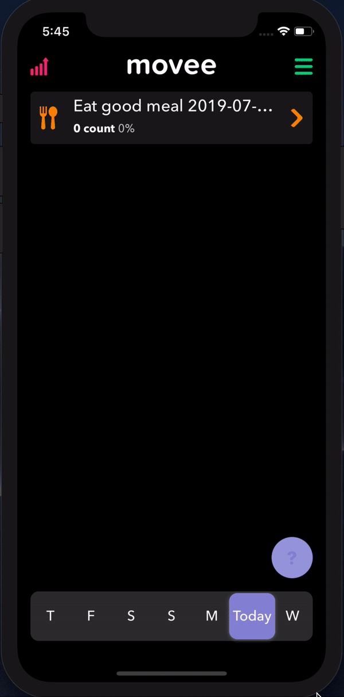&nbsp;&nbsp;&nbsp;&nbsp;&nbsp;
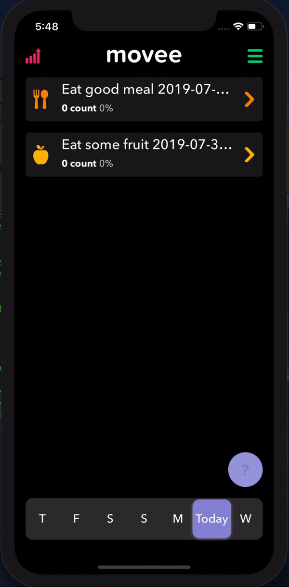&nbsp;&nbsp;&nbsp;&nbsp;&nbsp;

# swapi - TEST APP
[swapi](https://github.com/optionalDimension/swapi) — Star Wars app. RxSwift Realm

Role:  iOS developer. 

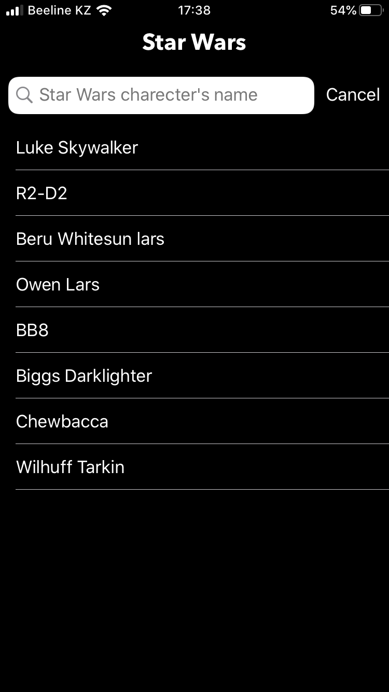&nbsp;&nbsp;&nbsp;&nbsp;&nbsp;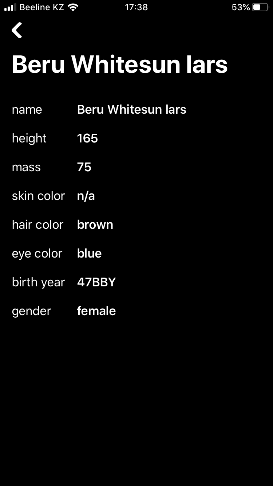&nbsp;&nbsp;&nbsp;&nbsp;&nbsp;

# Playgra - Battle Royale Matchmaker 
[Playgra](https://apps.apple.com/us/app/playgra/id1452101526?ls=1) — Playgra is a new matchmaker platform that allows you to find players around the world and play together.

Role: Solo iOS developer. 

Role: Firebase developer. 

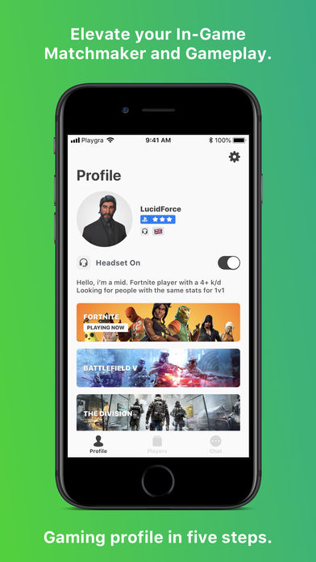&nbsp;&nbsp;&nbsp;&nbsp;&nbsp;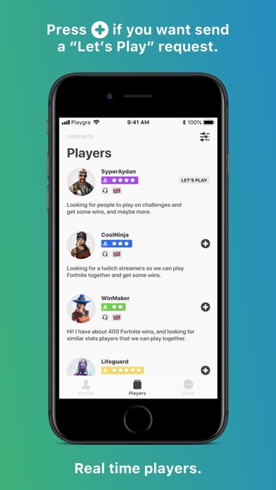&nbsp;&nbsp;&nbsp;&nbsp;&nbsp;
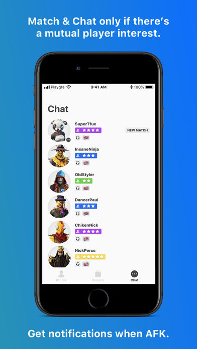

# Horror - Chat & Text Stories 
[Horror](https://apps.apple.com/AT/app/id1317234637?l=de) —Another campfire story? No! In the Horror app you will experience REAL fear.

The Horror Chat Stories is:

— trendy format that immerses you into the horror stories. Read chats to participate in the most terrific events;

— 50+ chats that will make your heart freeze: family curses, paranoid stalkings, secret confessions of psychopaths;

— shocking details of the most horrible crimes of our time.

Role: Solo iOS developer. 

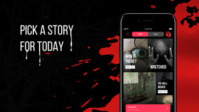&nbsp;&nbsp;&nbsp;&nbsp;&nbsp;&nbsp;&nbsp;&nbsp;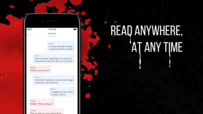

# Lollipop - Dating App
[Lollipop](https://sensortower.com/ios/ru/tehnosoft/app/lollipop-znakomstva-riadom/1342239793/overview) —Lollipop is a dating app, which helps you to find your match.

Role: Solo iOS developer. 

&nbsp;&nbsp;&nbsp;&nbsp;&nbsp;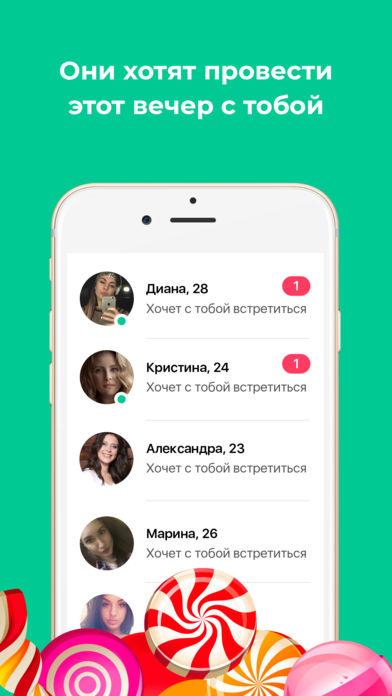&nbsp;&nbsp;&nbsp;&nbsp;&nbsp;

# CARGURU - Car sharing
[CARGURU](https://apps.apple.com/lv/app/carguru-car-sharing/id1229147815) —CARGURU is a car sharing service. The price for use includes absolutely all costs, including fuel, parking charge and insurance..

Role: Solo iOS developer. 

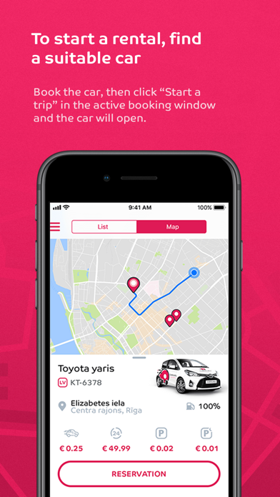&nbsp;&nbsp;&nbsp;&nbsp;&nbsp;&nbsp;&nbsp;&nbsp;&nbsp;&nbsp;

# Spanish with Lingualoro : start to speak Spanish in 16 hours
[Lingualoro](https://sensortower.com/ios/us/rauan-kussembayev/app/spanish-with-lingualoro-start-to-speak-spanish-in-16-hours/1093233307/overview) —Intensive Spanish course of 16 lessons . Importance of the method - not just study the language but to get into it and feel comfortable in the new environment.

Role: Solo iOS developer. 

Role: Designer 

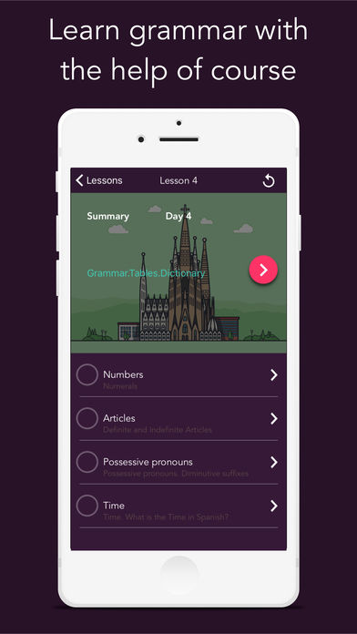&nbsp;&nbsp;&nbsp;&nbsp;&nbsp;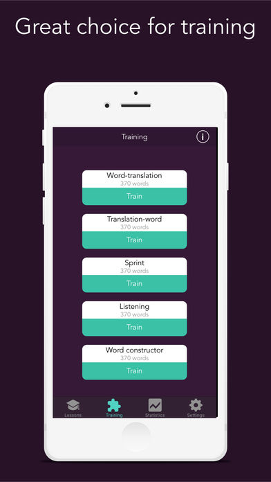&nbsp;&nbsp;&nbsp;&nbsp;&nbsp;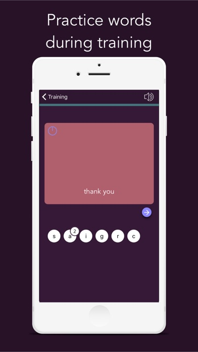

# Counter for YouTube
[Counter for YouTube](https://sensortower.com/ios/us/rauan-kussembayev/app/counter-for-youtube/1028942543/overview) —Watch youtube numbers live, unlimited channels.

Role: Solo iOS developer. 

Role: Designer 

&nbsp;&nbsp;&nbsp;&nbsp;&nbsp;&nbsp;&nbsp;&nbsp;&nbsp;&nbsp;

# 30 days challenges
[30 days challenges](https://sensortower.com/ios/us/rauan-kussembayev/app/30-days-challenges/1073293838/overview) —Try something new for 30 days.
Is there something you've always meant to do, wanted to do, but just ... haven't? Try this app, try it for 30 days.

Role: Solo iOS developer. 

Role: Designer 

&nbsp;&nbsp;&nbsp;&nbsp;&nbsp;&nbsp;&nbsp;&nbsp;&nbsp;&nbsp;

# Life countdown
[Life countdown](https://sensortower.com/ios/us/rauan-kussembayev/app/life-countdown-live-every-day/1080978372/overview) —"This app is intended for entertainment purposes only and does not provide true predictive functionality."
How much time do you have left to live?
Have you ever been countdown your remaining time? 
Let's try to calculate your approximate time to appreciate precious time.

Role: Solo iOS developer. 

Role: Designer 

&nbsp;&nbsp;&nbsp;&nbsp;&nbsp;&nbsp;&nbsp;&nbsp;&nbsp;&nbsp;

# Shotty
[Shotty](https://sensortower.com/ios/jp/rauan-kussembayev/app/shotty-300-cocktail-recipes/1072459410/overview) —Shotty shows you recipe of most popular cocktails.
Choose your base spirit, mixer garnishes and choose recipe for over 300 cocktails.

Role: Solo iOS developer. 

Role: Designer 

Role: Backend PHP 

&nbsp;&nbsp;&nbsp;&nbsp;&nbsp;&nbsp;&nbsp;&nbsp;&nbsp;&nbsp;

# Eatty
[Eatty](https://sensortower.com/ios/us/rauan-kussembayev/app/eatty/1071717212/overview) —Diet Progress Tracker
Getting fit consists of 80% eating well and water drinking and 20% exercise. Like how the perfect pizza is 80% topping and 20% base, but that's neither here nor there. 

Role: Solo iOS developer. 

Role: Designer 

&nbsp;&nbsp;&nbsp;&nbsp;&nbsp;&nbsp;&nbsp;&nbsp;&nbsp;&nbsp;

# Mecoffee
[Mecoffee](https://sensortower.com/ios/id/rauan-kussembayev/app/mecoffee/1030844941/overview) —My Second app, which helps you to drink coffee in a right way. 

Role: Solo iOS developer. 

Role: Designer 

&nbsp;&nbsp;&nbsp;&nbsp;&nbsp;&nbsp;&nbsp;&nbsp;&nbsp;&nbsp;&nbsp;&nbsp;&nbsp;&nbsp;&nbsp;&nbsp;

# Chemifun
[Chemifun](https://sensortower.com/ios/us/rauan-kussembayev/app/chemifun/1029232586/overview)—My first app, Periodic table with inorganic chemistry reactions. 

Role: Solo iOS developer. 

Role: Designer 

Role: Java Backend developer 

&nbsp;&nbsp;&nbsp;&nbsp;&nbsp;&nbsp;&nbsp;&nbsp;

## Thanks for stopping by!

# Contact Info:

- Email: optionalDimension@gmail.com
- LinkedIn: [optionalDimension](https://www.linkedin.com/in/optionalDimension/)
- Twitter: [@Optionaldimens](https://twitter.com/Optionaldimens)
- Website: [coming soon]()
