&nbsp;&nbsp;&nbsp;&nbsp;&nbsp;&nbsp;&nbsp;&nbsp;&nbsp;

# Counter for YouTube
[Counter for YouTube](https://sensortower.com/ios/us/rauan-kussembayev/app/counter-for-youtube/1028942543/overview) —Watch youtube numbers live, unlimited channels.

Role: Solo iOS developer. 

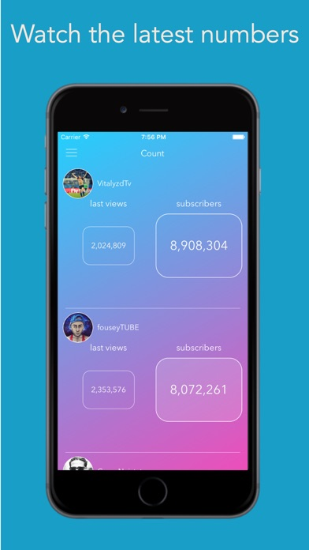&nbsp;&nbsp;&nbsp;&nbsp;&nbsp;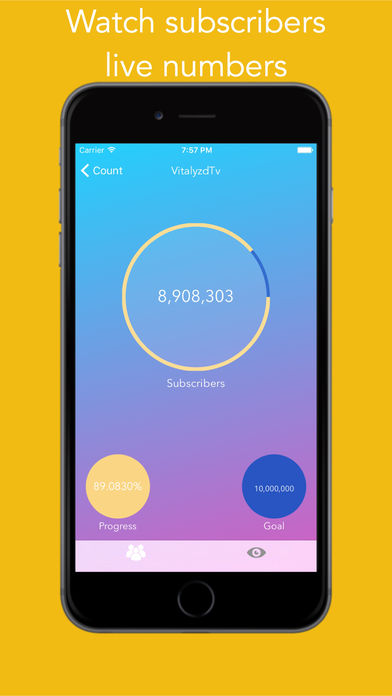&nbsp;&nbsp;&nbsp;&nbsp;&nbsp;

# 30 days challenges
[30 days challenges](https://sensortower.com/ios/us/rauan-kussembayev/app/30-days-challenges/1073293838/overview) —Try something new for 30 days.
Is there something you've always meant to do, wanted to do, but just ... haven't? Try this app, try it for 30 days.

Role: Solo iOS developer. 

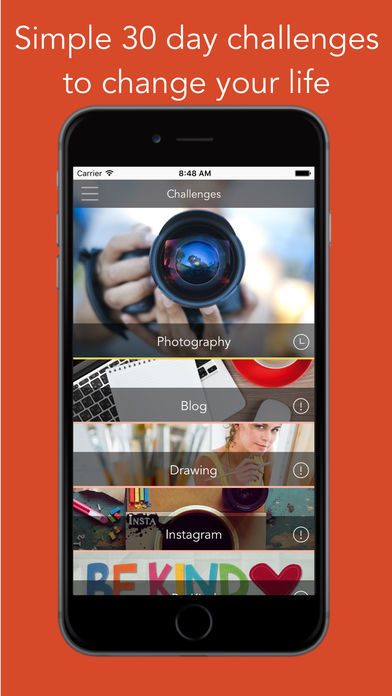&nbsp;&nbsp;&nbsp;&nbsp;&nbsp;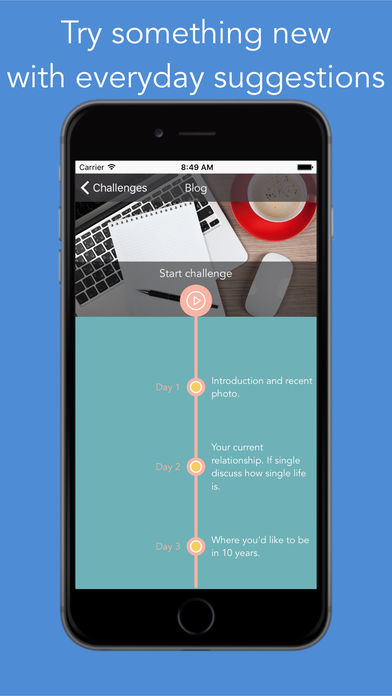&nbsp;&nbsp;&nbsp;&nbsp;&nbsp;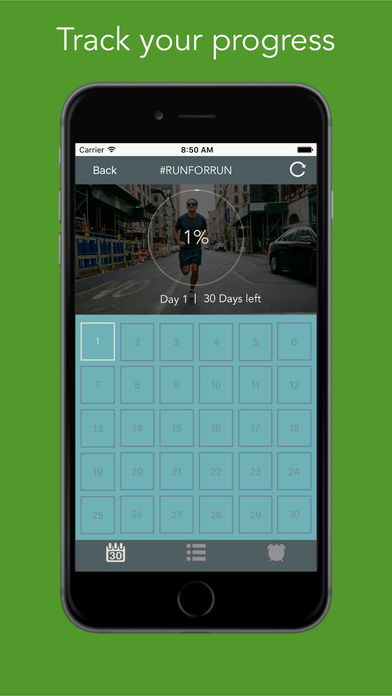

# Life countdown
[Life countdown](https://sensortower.com/ios/us/rauan-kussembayev/app/life-countdown-live-every-day/1080978372/overview) —"This app is intended for entertainment purposes only and does not provide true predictive functionality."
How much time do you have left to live?
Have you ever been countdown your remaining time? 
Let's try to calculate your approximate time to appreciate precious time.

Role: Solo iOS developer. 

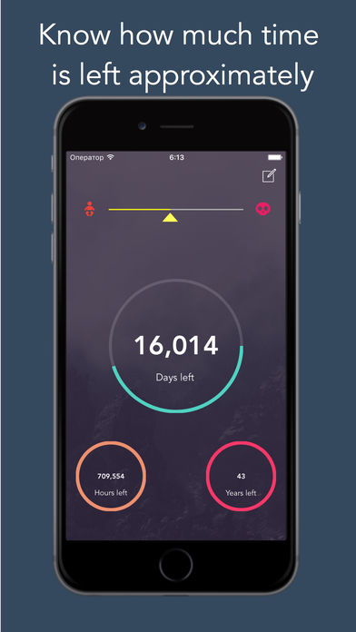&nbsp;&nbsp;&nbsp;&nbsp;&nbsp;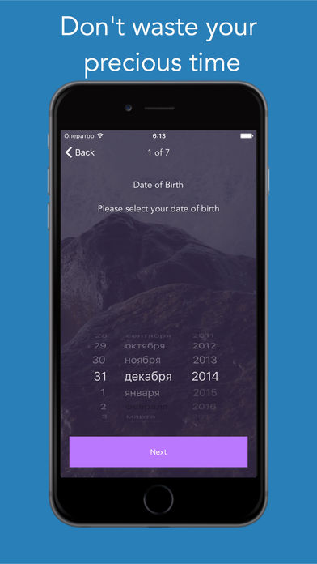&nbsp;&nbsp;&nbsp;&nbsp;&nbsp;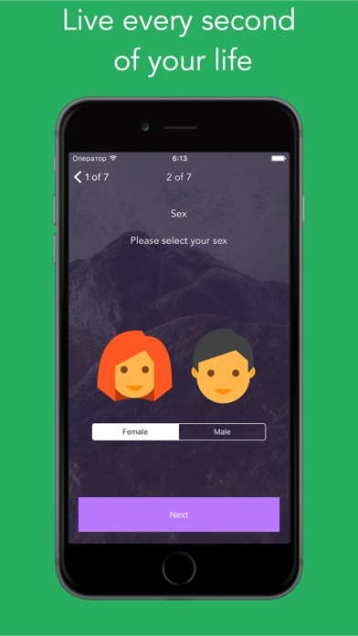

# Shotty
[Shotty](https://sensortower.com/ios/jp/rauan-kussembayev/app/shotty-300-cocktail-recipes/1072459410/overview) —Shotty shows you recipe of most popular cocktails.
Choose your base spirit, mixer garnishes and choose recipe for over 300 cocktails.

Role: Solo iOS developer. 

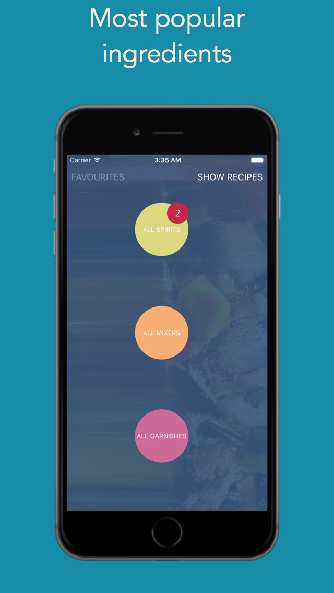&nbsp;&nbsp;&nbsp;&nbsp;&nbsp;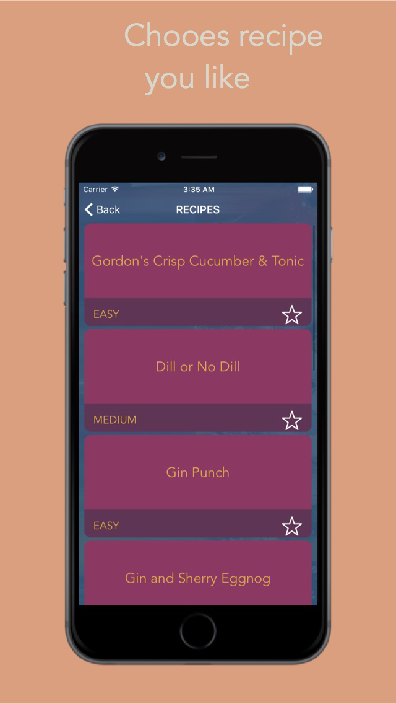&nbsp;&nbsp;&nbsp;&nbsp;&nbsp;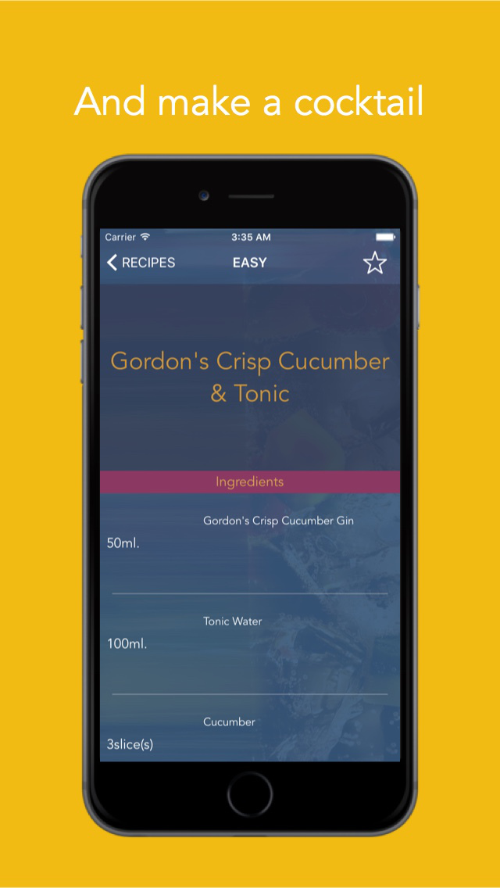

# Eatty
[Eatty](https://sensortower.com/ios/us/rauan-kussembayev/app/eatty/1071717212/overview) —Diet Progress Tracker
Getting fit consists of 80% eating well and water drinking and 20% exercise. Like how the perfect pizza is 80% topping and 20% base, but that's neither here nor there. 

Role: Solo iOS developer. 

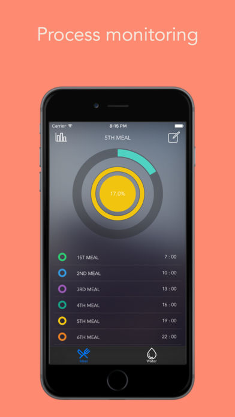&nbsp;&nbsp;&nbsp;&nbsp;&nbsp;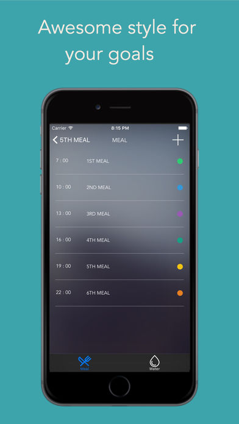&nbsp;&nbsp;&nbsp;&nbsp;&nbsp;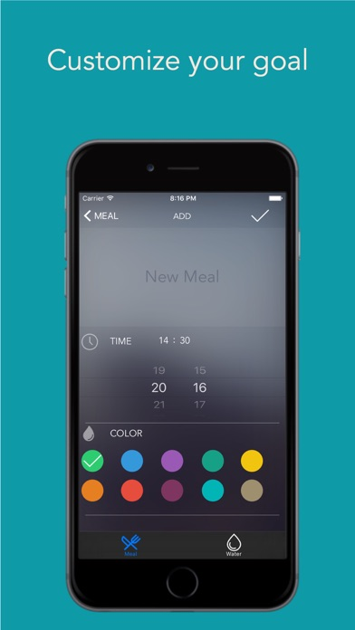

# Mecoffee
[Mecoffee](https://sensortower.com/ios/id/rauan-kussembayev/app/mecoffee/1030844941/overview) —My Second app, which helps you to drink coffee in a right way. 

Role: Solo iOS developer. 

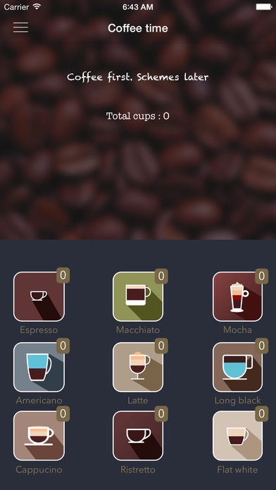&nbsp;&nbsp;&nbsp;&nbsp;&nbsp;&nbsp;&nbsp;&nbsp;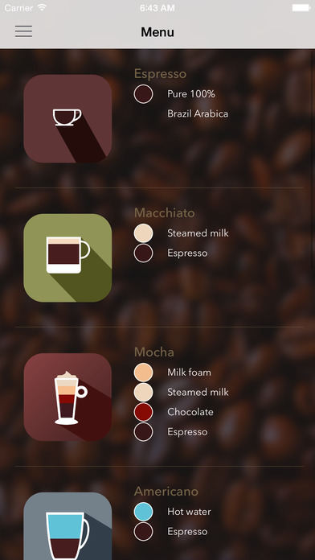&nbsp;&nbsp;&nbsp;&nbsp;&nbsp;&nbsp;&nbsp;&nbsp;

# Chemifun
[Chemifun](https://sensortower.com/ios/us/rauan-kussembayev/app/chemifun/1029232586/overview)—My first app, Periodic table with inorganic chemistry reactions. 

Role: Solo iOS developer. 

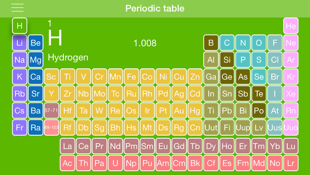&nbsp;&nbsp;&nbsp;&nbsp;&nbsp;&nbsp;&nbsp;&nbsp;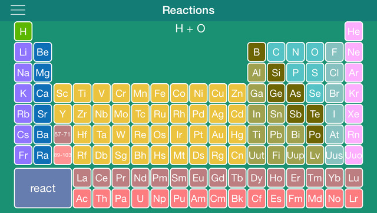

## Thanks for stopping by!

# Contact Info:

- Email: optionalDimension@gmail.com
- LinkedIn: [optionalDimension](https://www.linkedin.com/in/optionalDimension/)
- Twitter: [@Optionaldimens](https://twitter.com/Optionaldimens)
- Website: [coming soon](https://gg.com)
