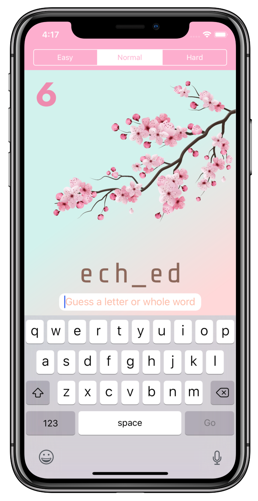
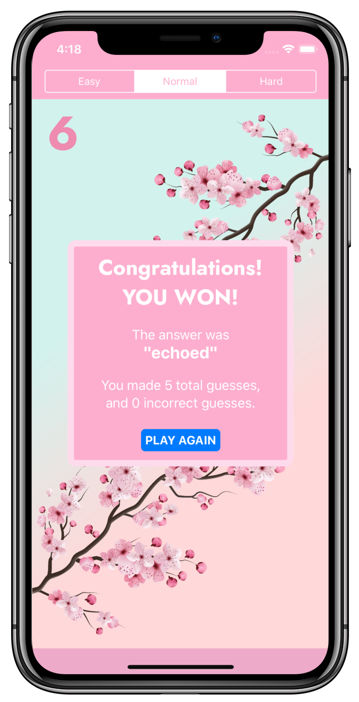
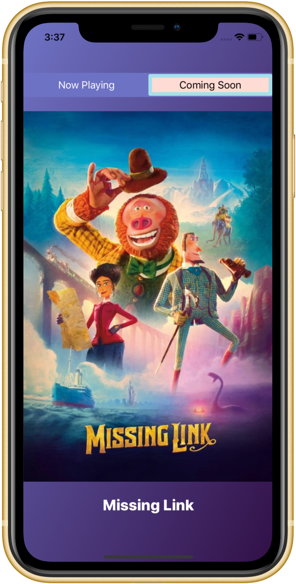
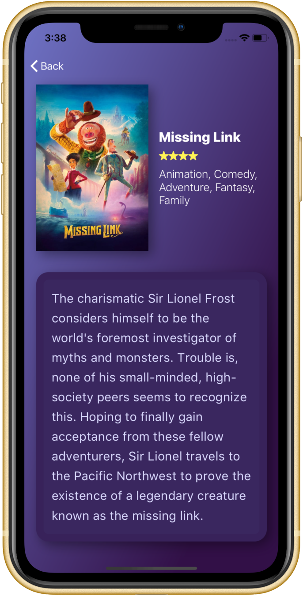

&nbsp;&nbsp;&nbsp;&nbsp;&nbsp;&nbsp;&nbsp;&nbsp;&nbsp;

<!-- # Hello!
*Thanks for stopping by*. This repo serves as a kind of ever-changing portfolio of projects I'm currently excited about; please feel free to look around. -->
# Sakura
Sakura is an iOS word-guessing game, which I recently built as a take-home project. The specs were to build a basic 'hangman' game, and to then extend it as I saw fit. I decided to run with it and build something a bit more positive, creative, and colorful. In my app, the Sakura tree loses blooms each time you make an incorrect guess. If you guess the word correctly, the tree bursts back into bloom with a lovely animation.

I'm extremely pleased with how the project came out. I'm particularly proud of the app's animation, UI design, and easily-extended architecture. Sakura was built with Xcode and written entirely in Swift 5; it utilizes Auto Layout for UI design, and makes extensive use of both UIView animations and CAEmitterLayers.  

&nbsp;&nbsp;&nbsp;&nbsp;&nbsp;&nbsp;&nbsp;&nbsp;&nbsp;&nbsp;

# DarkRoom
[DarkRoom](https://github.com/cmilr/dark-room) is a take-home project I recently completed as part of the interview process for an iOS Developer role. The basic requirements for the app were that it display ten currently showing movies and ten upcoming movies, using data from [themoviedb.org](https://www.themoviedb.org/)'s REST api. Choice of design and UI elements were left open to the developer.

I'm quite happy with the final product: DarkRoom was built entirely in Swift, with no external dependencies, and the UI—which was created using Auto Layout in Interface Builder—is attractive and animates smoothly. Most importantly, the code is clean, easy to reason about, and maintains strong separation of concerns.

<!-- &nbsp;&nbsp;&nbsp;&nbsp;&nbsp;&nbsp;&nbsp;&nbsp;&nbsp;&nbsp;&nbsp;&nbsp;&nbsp;&nbsp;&nbsp;&nbsp;&nbsp;&nbsp;&nbsp;&nbsp;   -->

&nbsp;&nbsp;&nbsp;&nbsp;&nbsp;&nbsp;&nbsp;&nbsp;&nbsp;&nbsp;&nbsp;&nbsp;&nbsp;&nbsp;&nbsp;&nbsp;

# Chemifun
[Chemifun](https://sensortower.com/ios/us/rauan-kussembayev/app/chemifun/1029232586/overview)—My first app, Periodic table with inorganic chemistry reactions.

&nbsp;&nbsp;&nbsp;&nbsp;&nbsp;&nbsp;&nbsp;&nbsp;

## Thanks for stopping by!

# Contact Info:

- Email: optionalDimension@gmail.com
- LinkedIn: [optionalDimension](https://www.linkedin.com/in/optionalDimension/)
- Twitter: [@Optionaldimens](https://twitter.com/Optionaldimens)
- Website: [coming soon](https://gg.com)
